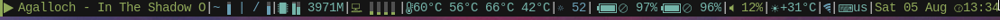

# dwmblocks-status2d
This repo is unmentained, but the sripts are considered complete.
Scripts for dwmblocks made to work with the status2d dwm patch.
All scripts are relatevly unbloated by avoiding slow commands.

## Screenshot

# Patches
The original status2d patch from the suckless wiki is still required.
`dwm-status2d-swap-save-restore-6.2.diff`
Required for most blocks.
`dwm-status2d-xrdb-6.2.diff`
Only reqired if you wish to use XRDB colors (e.g. pywal).
It is quite ugly, feel free to rewrite it in a cleaner way.
Requires the xrdb dwm patch.

# Example
`blocks.h`
An example `blocks.h`.
`statusbar`
An example wrapper that starts background monitors and dwmblocks.

# Monitors
Scripts to run in the background in order to update specific blocks based on events.
`dwmblocks_monitor_mpd`
Update on mpd play/pause/stop and song change.
`dwmblocks_monitor_net`
Updates on network state change. It is very hacky, I wouldn't use it.

# Extra
Rules to update specific blocks.
`udev_rules/99-dwmblocks.rules`
Update the battery icon on plugging/unplugging AC.
`zzz_resume/refresh_dwmblocks`
Update blocks after suspend/hibernate. Obviously only when using `zzz` for suspending.
